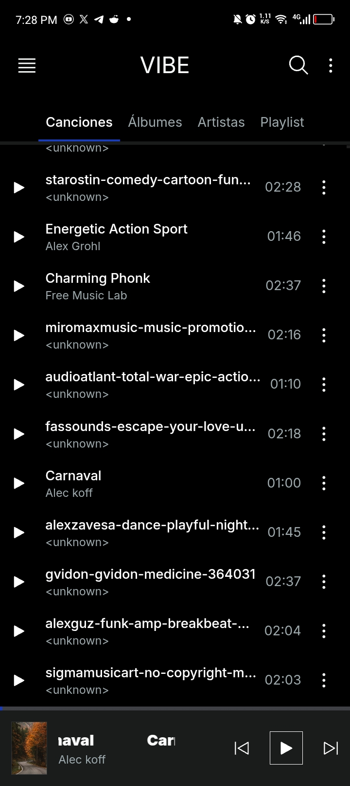
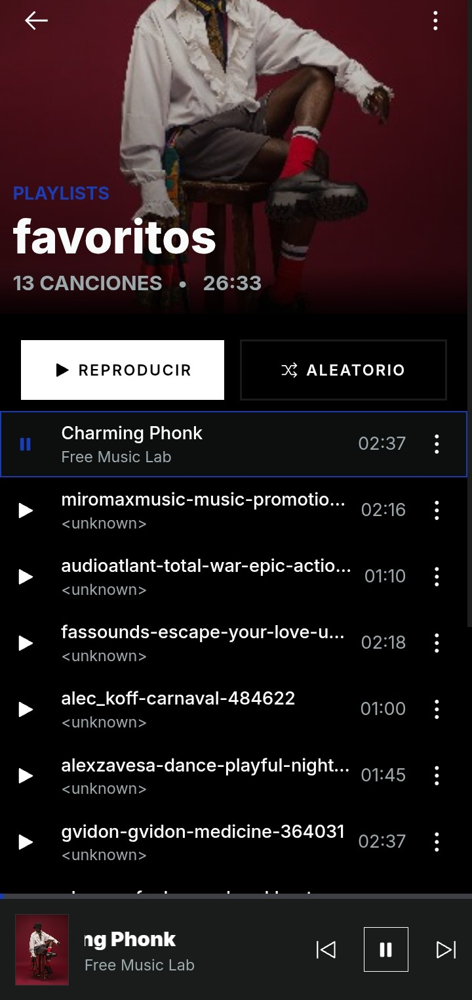
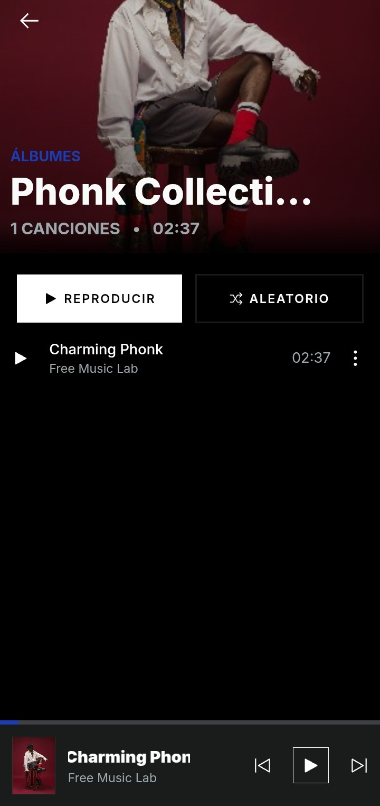

https://github.com/user-attachments/assets/bb9c6b3d-9a11-46e1-8010-32d19ab609bc

<p align="center">
  <a href="https://f-droid.org/packages/dev.fiedri.vibe/">
    
  </a>
</p>

---

# Vibe

Music player for Android.

## Features

| Feature |
| --- |
| Persistent player state: play, pause, next and previous |
| Playback modes: shuffle, repeat one and repeat all |
| Home, playlists, albums and artists views |
| Persistent playlists in SQLite |
| Search and filter in every section |
| Native media notification (MediaSession) with system controls |
| State restoration when reopening the app |

## Installation

### Users

Download the latest APK from the [Releases](https://github.com/fiedri/vibe-player/releases) section.

---

### Developers

#### Prerequisites
* [Node.js](https://nodejs.org/) (>= 22.0.0)
* [pnpm](https://pnpm.io/) (recommended) or npm

#### Setup

```bash
# 1. Clone repository
git clone https://github.com/fiedri/vibe-player.git

# 2. Navigate to directory
cd vibe-player

# 3. Install dependencies
pnpm install
```

### How to run
- **Web Mode (Browser)**
```bash
pnpm run dev
```

- **Live Reload on Device**:
Connect your phone via USB with debugging enabled and run:
```bash
# Raise the server
pnpm run dev --host

# Sync Capacitor and open in Android
pnpm dev:android
```

- **Build and run on Device:**
```bash
# Build the frontend and sync Capacitor
pnpm build:android

# Compile and run the app
npx cap run android
```

## Screenshots
<p align="center">
  
  &nbsp;&nbsp;&nbsp;&nbsp;
  
    
</p>

## License

[Vibe](https://github.com/fiedri/vibe-player) is free and open-source software, licensed under [GPL-3.0-or-later](LICENSE).

See the [LICENSE](LICENSE) file for details.
